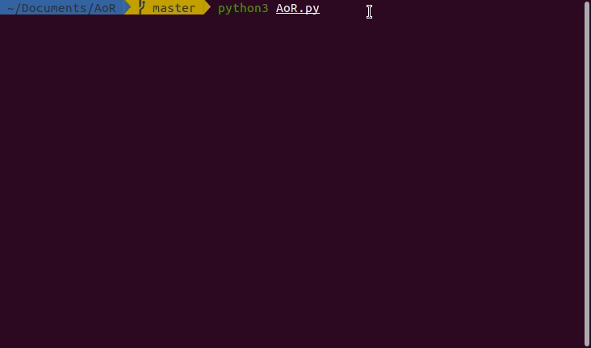

# Advent of Random - AoR

The purpose of AoR is to add a challenge over [Advent of Code](https://adventofcode.com/) by giving you a random language to use everyday !  
AoR is a very simple python script, **launch it once to setup** your username and languages then launch it once everyday to know what language to use !
The random picked language is picked in a bag, like tetris tetrominoes you will have to pass through every language before having a chance to see your favorite langage pop again 😉 

- usage : `python3 AoR.py`
- help :  `python3 AoR.py -h`

